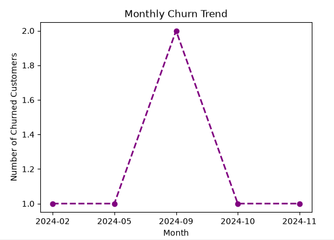
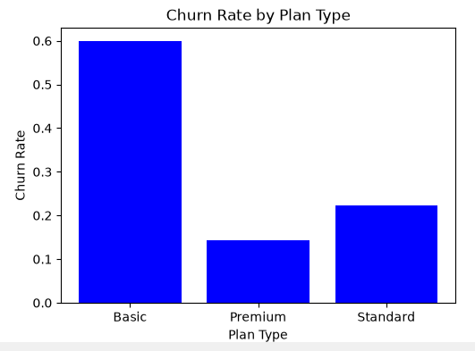
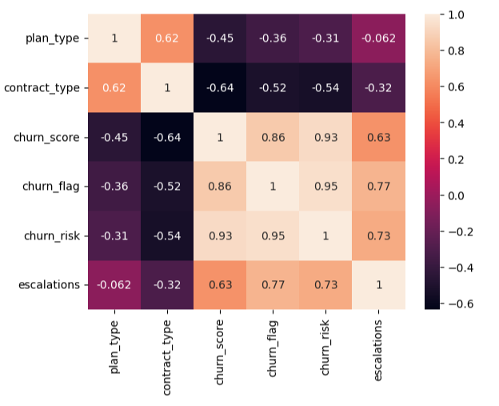
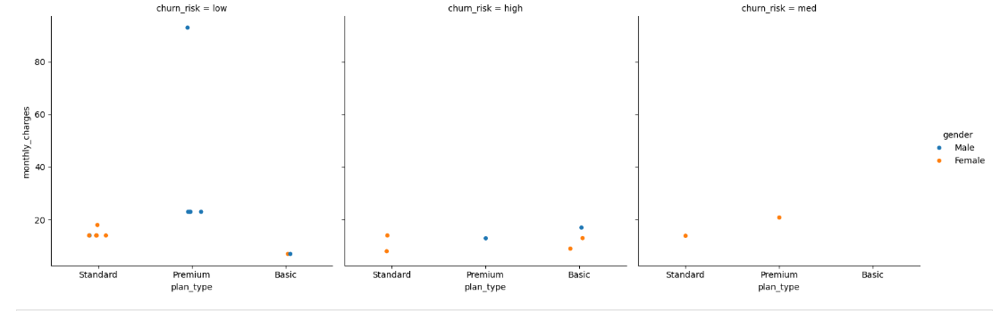
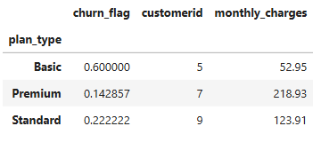

# 📊 Customer Churn Analysis & Customer Intelligence
### End-to-End Data Analytics Project | Excel • Python • SQLite

---

## 📌 Project Overview

Customer retention is one of the most important challenges for subscription-based businesses. This project focuses on analyzing customer behavior, identifying churn patterns, and generating actionable business recommendations using an end-to-end data analytics workflow.

The project integrates multiple datasets, performs data cleaning, feature engineering, exploratory data analysis (EDA), KPI analysis, and customer intelligence reporting to understand why customers leave and how businesses can improve retention.

---

## 🎯 Project Objectives

- Integrate customer, subscription, and support datasets.
- Clean and preprocess raw data.
- Create a unified analytical dataset.
- Build customer churn indicators.
- Calculate key business KPIs.
- Perform exploratory data analysis.
- Identify churn drivers.
- Generate business recommendations for improving customer retention.

---

## 🛠️ Tech Stack

| Tool | Purpose |
|------|----------|
| 📊 Microsoft Excel | Raw Data |
| 🐍 Python | Data Cleaning & Analysis |
| 🗄️ SQLite | Data Storage |
| 📈 Pandas | Data Manipulation |
| 📉 Matplotlib | Visualization |
| 🎨 Seaborn | Statistical Visualization |

---

## 📂 Dataset

The project combines three business datasets:

- Customer Information
- Subscription Details
- Customer Support Records

The datasets are merged into a single analytical dataset for customer intelligence.

---

## 🔄 Project Workflow

```text
Raw Excel Data
      │
      ▼
Import into SQLite Database
      │
      ▼
Data Cleaning & Transformation
      │
      ▼
Feature Engineering
      │
      ▼
Exploratory Data Analysis
      │
      ▼
KPI Calculation
      │
      ▼
Business Insights & Recommendations
```

---

# 📊 Project Outputs

The project delivers:

- Cleaned analytical dataset
- SQLite database
- Customer churn analysis
- KPI calculations
- Business intelligence report
- Data visualizations
- Customer risk segmentation

---

# 📈 Key Performance Indicators (KPIs)

The project measures important customer retention metrics, including:

- Churn Rate
- Retention Rate
- Churn Rate by Plan Type
- Average Revenue Per User (ARPU)
- Average Customer Tenure
- Revenue at Risk
- Escalation Rate
- Average Complaints per User
- Correlation Between Escalation and Churn

---

# 📊 Visualizations

The project includes several visual analyses, such as:

## Monthly Churn Trend



## Churn Rate by State


## Churn Rate by Plan Type



## Correlation Heatmap



## Pair Plot Analysis

## Catplot Analysis



## Pivot Table Analysis



---

# 💡 Business Insights

The analysis identified several important findings:

- Customer churn remains a significant business challenge.
- Basic plan customers exhibit the highest churn risk.
- Premium customers demonstrate stronger loyalty and lower churn.
- Complaint escalations are strongly associated with customer churn.
- Revenue loss is directly linked to customer cancellations.
- Long-tenure customers contribute greater lifetime value.

---

# 📋 Business Recommendations

Based on the analysis:

- Improve benefits offered under the Basic subscription plan.
- Encourage upgrades to higher-value plans.
- Reduce complaint escalation rates through faster issue resolution.
- Implement proactive retention campaigns for high-risk customers.
- Reward long-tenure customers with loyalty programs.
- Continuously monitor churn KPIs using business dashboards.

---

# 🚀 Skills Demonstrated

- Data Cleaning
- Data Transformation
- Data Integration
- SQLite Database
- Feature Engineering
- Exploratory Data Analysis (EDA)
- KPI Development
- Customer Segmentation
- Business Intelligence
- Data Visualization
- Business Reporting

---

# 📁 Repository Structure

```text
Customer_Churn_Analysis/
│
├── Dataset/
│   ├── customer_churn_data_raw.xlsx
│   └── exported_churn_data.csv
│
├── Python/
│   └── churn_analysis.py
│
├── Database/
│   └── customer_churn.db
│
├── Images/
│   ├── monthly_churn_trend.png
│   ├── churn_rate_by_state.png
│   ├── churn_rate_by_plan_type.png
│   ├── correlation_heatmap.png
│   └── catplotplot.png
│   ├── pivot_table.png
├── Reports/
│   └── Churn Analysis and Customer Intelligence.pdf
│
└── README.md
```

---

## 📄 Project Report

The repository includes a detailed report covering:

- Executive Summary
- KPI Analysis
- Business Insights
- Business Recommendations
- Customer Intelligence Findings

---

⭐ If you found this project useful, consider giving it a star!
